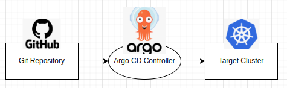
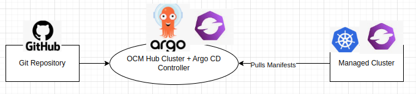

# argocd-ocm-cmp
Argo CD and Open Cluster Management (OCM) Integration using Argo CD Config Management Plugin (CMP).

# Overview

Argo CD traditionally follows a push model, where the Argo CD controller retrieves the Git manifests from a Git repository,
connects to a target cluster, and applies those manifests.



This repository contains a POC example of using Open Cluster Management (OCM) to enable Argo CD pull model application deployment via the Argo CD Config Management Plugin (CMP).



Instead of the traditional push model, where manifests are applied directly to the target clusters,
the CMP wraps these manifests within an OCM-io ManifestWork resource.
This ManifestWork is created on the hub cluster. When a managed cluster work agent pulls the ManifestWork workload,
the work agent on the managed cluster applies the application manifests.

This is different from the ArgoCD OCM pull integration: https://argo-cd.readthedocs.io/en/stable/user-guide/skip_reconcile/#primary-use-case
where the existing pull model does not reconcile the ArgoCD Application CR on the hub cluster.
Instead, it wraps the Application inside the ManifestWork, which is then pulled to the managed cluster and reconciled there.
When the Application reconciles on the managed cluster,
it pulls from the Git repository and deploys the manifests into its local cluster.
This requires each managed cluster to have an ArgoCD controller installed. 

# Benefits

Compared to the traditional Argo CD push model

- Simplicity is the key advantage. Managed clusters do not need to have the Argo CD controller installed.
Reducing the complexity of the setup on managed clusters.

- Better security model where the hub cluster doesn't hold any creds to managed clusters.

- Reduce polling against the Git repository.
Each managed cluster does not need to communicate with the Git repository to pull the manifest data, significantly reducing network traffic load.
This also makes the Git repository much less likely to encounter request limits.

- The POC currently does not require compiling any code or building any new images.

# Prereqs
Setup an OCM-io environment: a hub cluster and a managed cluster.

Install Argo CD and CMP on the hub cluster.

See Quick Start for more details.

# Flows

Argo CD guestbook Application reconciles on the hub cluster.

=> Targetting GitOps folder: https://github.com/mikeshng/argocd-ocm-cmp/tree/main/guestbook

=> The CMP plugin loops through k8s yaml manifests in that folder.

=> Wrap them inside a OCM-io ManifestWork

=> The ManifestWork is created on the hub cluster's managed cluster namespace

=> The managed cluster work agent pulls the ManifestWork from hub cluster.

=> The work agent deploys the manifests in the managed cluster

=> guestbook Application manifests are now deployed on the managed cluster

# Quick Start

```
# assumes OCM-io a kind-hub and kind-cluster1 are created to act as hub and managed cluster
git clone https://github.com/mikeshng/argocd-ocm-cmp.git
cd argocd-ocm-cmp
kind export kubeconfig --name hub
kubectl create ns argocd
kubectl apply -n argocd -f https://raw.githubusercontent.com/argoproj/argo-cd/v2.11.2/manifests/core-install.yaml
kubectl apply -f proj.yaml
kubectl apply -f cm_plugin.yaml
kubectl apply -f deploy_cmp.yaml
kubectl wait --for=condition=available deployment/argocd-repo-server -n argocd --timeout=300s
kubectl wait --for=condition=ready pod -l app.kubernetes.io/name=argocd-repo-server --namespace argocd
kubectl apply -f app.yaml
sleep 10s
# done
```

## Expected Output

On the hub cluster:

```
$ kind export kubeconfig --name hub
$ kubectl -n cluster1 get manifestwork guestbook -o yaml
apiVersion: work.open-cluster-management.io/v1
kind: ManifestWork
metadata:
...
  name: guestbook
  namespace: cluster1
...
spec:
  workload:
    manifests:
    - apiVersion: apps/v1
      kind: Deployment
      metadata:
        name: guestbook-ui
        namespace: default
      spec:
        replicas: 1
...
    - apiVersion: v1
      kind: Service
      metadata:
        name: guestbook-ui
        namespace: default
      spec:
        ports:
...
status:
  conditions:
  - lastTransitionTime: "2024-06-28T20:47:19Z"
    message: Apply manifest work complete
    observedGeneration: 1
    reason: AppliedManifestWorkComplete
    status: "True"
    type: Applied
  - lastTransitionTime: "2024-06-28T20:47:19Z"
    message: All resources are available
    observedGeneration: 1
    reason: ResourcesAvailable
    status: "True"
    type: Available
...
```

On the managed cluster:

```
$ kind export kubeconfig --name cluster1
$ kubectl get deploy guestbook-ui; kubectl get svc guestbook-ui
NAME           READY   UP-TO-DATE   AVAILABLE   AGE
guestbook-ui   1/1     1            1           3m14s
NAME           TYPE        CLUSTER-IP      EXTERNAL-IP   PORT(S)   AGE
guestbook-ui   ClusterIP   10.96.133.236   <none>        80/TCP    3m14s
```

# Considers and TODOs

This repository is primarily a POC and welcomes the community to help further expand on this idea and flesh out additional details and gaps,
such as:

- Application CR status.

- Argo CD UI.
